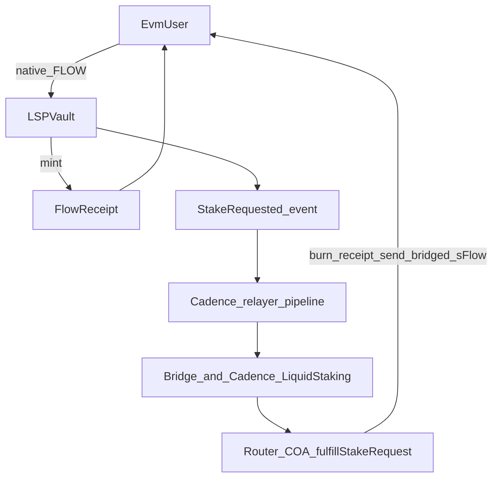
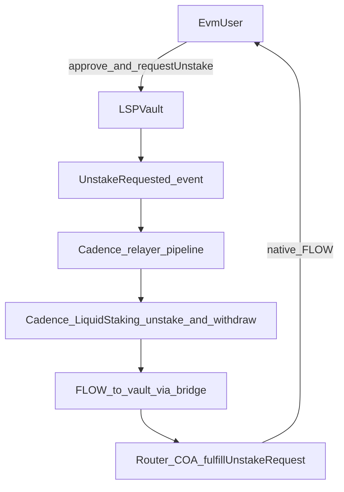
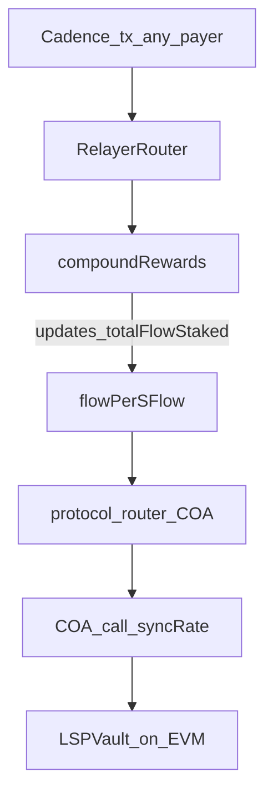

# Flow native liquid staking (Cadence + EVM + relayer)

This repo implements a minimal liquid staking protocol (LSP) for FLOW: users receive `sFlow` (Cadence fungible token) representing staked FLOW. Rewards compound into the exchange rate. An optional EVM vault accepts native FLOW from Flow EVM users via a receipt token and **relayer-driven** fulfillment.

Three moving parts:

1. **Cadence** — core staking, `sFlow` mint/burn, Flow `NodeDelegator`, reward compounding, unstake lifecycle.
2. **EVM** — `LSPVault` + `FlowReceipt`: request/fulfill pattern for users who interact only on Flow EVM.
3. **Relayer** — off-chain process (or any payer account) that submits **Cadence** transactions. EVM fulfillments and `syncRate` use the **protocol router COA** embedded in **`RelayerRouter`**; governance actions use **`LiquidStakingConfig.Admin`** (which holds the **governance COA** for EVM owner-style calls).

---

## Who owns what (control plane)

| Actor / object | Owns or controls |
|----------------|------------------|
| **Protocol Cadence account** | Deployed `sFlowToken`, `LiquidStaking`, `LiquidStakingConfig`, `EVMRoute`, **`RelayerRouter`**; `NodeDelegator`, withdraw pool, treasury FLOW vault. Bootstrap creates COAs under e.g. `/storage/liquid_staking_protocol_router_coa` (router) and `/storage/liquid_staking_protocol_governance_coa` (governance); **phase 3** moves the router COA **into** `RelayerRouter` deployment. That router COA’s EVM address is **`ROUTER_COA`** on `LSPVault` (fulfill / `syncRate`). **`RelayerRouter`** exposes **permissionless** `access(all)` entrypoints on-chain (no capability publish needed). |
| **Admin account (post-handoff)** | **`LiquidStakingConfig.Admin`** at `LiquidStakingConfig.AdminStoragePath`, embedding the **governance COA** used for `LSPVault` “owner” style updates and **`EVMRoute`** admin helpers (`setStakingPaused`, fee/min sync, etc.). Use **`cadence/transactions/protocol/transfer_admin.cdc`** to move `Admin` between Cadence accounts. |
| **Users** | On EVM: EOAs and approvals toward `LSPVault`. On Cadence: **`cadence/transactions/user/`** (`stake`, `unstake`, `withdraw`) for direct flows, tests, and custom clients. |
| **Relayer** | Any account that pays fees and passes **batch request ids** (from indexing or polling) into **`cadence/transactions/relayer/*.cdc`** — no `LiquidStakingConfig.Admin` access required. |

**Important:** After bootstrap, **governance** (fee, pauses, min stake, EVM-aligned flags) is signed by whoever holds **`LiquidStakingConfig.Admin`**. **Queue operations** (EVM stake/unstake fulfillment, compounding + rate sync) are **permissionless** via **`RelayerRouter`**. If relayers are offline, EVM fulfillment and housekeeping may stall until someone submits the relayer transactions again.

---

## 1. Cadence contracts

| Contract | Role |
|----------|------|
| `sFlowToken.cdc` | FungibleToken-compliant liquid staking token; mint/burn gated to the same account as `LiquidStaking`. |
| `LiquidStakingConfig.cdc` | Governance parameters (fee, pauses, min stake, unstake delay), **`Admin`** (delegator registration, EVM governance COA), and storage paths for delegator / withdraw pool. |
| `LiquidStaking.cdc` | Protocol accounting (`totalFlowStaked`), `NodeDelegator`, withdraw pool, and public `stake` / `unstake` / `withdraw`. **`RelayerRouter`** calls `stake` / `unstake` / `withdraw` for EVM paths; **`withdraw`** consumes a `FlowReceipt` after the unlock epoch. |

**Exchange rate (Cadence)**  
`flowPerSFlow = totalFlowStaked / sFlowToken.totalSupply` (and inverse for minting on stake). Compounding increases `totalFlowStaked` without minting new `sFlow`, so each `sFlow` gradually represents more FLOW.

**Cadence `stake` / `unstake` / `withdraw`**  
Available on-contract for **`RelayerRouter`**, tests, and **`cadence/transactions/user/`**. See e.g. **`cadence/transactions/user/withdraw.cdc`** after the epoch gate (`FlowEpoch` + `LiquidStakingConfig.unstakeUnlockEpochDelay`).

Unstaking follows Flow’s normal staking cooldown (no instant exit).

---

## 2. EVM contracts

| Contract | Role |
|----------|------|
| `FlowReceipt.sol` | ERC-20 “receipt” minted to the user immediately on `requestStake`; burned when the stake is fulfilled. |
| `LSPVault.sol` | Holds native FLOW and locked bridged `sFlow`; `fulfillStakeRequest` / `fulfillUnstakeRequest` / `syncRate` / withdraw helpers are **`onlyRouterCOA`**; broad config updates go through the **owner** (deploy/bootstrap sets this to the **governance COA** EVM address; **`LiquidStakingConfig.Admin`** holds the matching Cadence COA for **`EVMRoute`** calls). **ROUTER_COA** is the **protocol router COA** baked into **`RelayerRouter`**. |

**Staking (EVM user)**  
User calls `requestStake` with native FLOW. The vault records a pending stake, mints **receipt** tokens at the vault’s cached rate, and emits an event. The user does **not** receive VM-bridged `sFlow` in the same transaction.

**What the relayer does for EVM stake**  
Observe events or poll EVM, then submit **`cadence/transactions/relayer/handle-stakes.cdc`** with **`stakeRequestIds: [UInt256]`**. **`RelayerRouter.handleStakes`** reads each request via the router COA, pulls FLOW from the vault, stakes on Cadence, bridges `sFlow`, transfers ERC-20 into `LSPVault`, and the router COA calls `fulfillStakeRequest`.

**Unstaking (EVM user)**  
User approves and calls `requestUnstake`; bridged `sFlow` is pulled into the vault and an unstake request is recorded.

**What the relayer does for EVM unstake**  
1. **`cadence/transactions/relayer/initiate-unstakes.cdc`** with **`unstakeRequestIds: [UInt256]`** — bridge `sFlow`, **`LiquidStaking.unstake`**, confirm on the vault.  
2. After the Cadence unlock epoch for each receipt, **`cadence/transactions/relayer/finalize-unstakes.cdc`** with the same ids — **`LiquidStaking.withdraw`**, bridge FLOW native to the vault, **`fulfillUnstakeRequest`**.

There is **no** separate `process_epoch_unstakes` transaction in this repo; epoch gating is enforced inside **`LiquidStaking.withdraw`** when the relayer runs finalize.

---

## 3. Relayer bot

The relayer is **not** a trustless chain primitive; it submits **deterministic**, auditable **Cadence** transactions when chain state allows progress. EVM vault calls run **inside** those transactions via the router COA. A separate EVM private key is unnecessary if all vault access goes through COAs as implemented.

Typical responsibilities:

**Per epoch (Cadence-first)**  
- **`cadence/transactions/relayer/compound.cdc`** (no arguments) — calls **`RelayerRouter.compoundAndSyncRate()`**: `LiquidStaking.compoundRewards()` then **`EVMRoute.syncRate`** on `LSPVault`.

**EVM queues (batched ids)**  
- Poll `stakeRequestCount` / `unstakeRequestCount` and per-request status, or index events.  
- Stakes: **`handle-stakes.cdc`** (`stakeRequestIds`).  
- Unstakes: **`initiate-unstakes.cdc`** → wait until **`withdraw`** preconditions pass → **`finalize-unstakes.cdc`** (`unstakeRequestIds`).

**Operational notes**  
- **`compound.cdc`** is the only no-arg relayer transaction here; stake/unstake txs **require request id arrays** chosen off-chain.  
- **Governance** uses **`LiquidStakingConfig.Admin`** and the txs under **`cadence/transactions/admin/`** (see contract for exact EVM mirroring).  
- Liveness and ordering are operational risks (delayed fulfillment), not authorization to steal funds, if contracts enforce amounts and destinations.

---

## Flow-EVM diagram

### EVM: stake with relayer fulfillment

### EVM: unstake with relayer fulfillment

### Relayer: `compound.cdc` (Cadence + EVM rate)

One Cadence transaction: compound rewards on `LiquidStaking` via **`RelayerRouter.compoundAndSyncRate`**, then the protocol router COA calls `syncRate` on `LSPVault`.

---

## Admin: protocol deploy vs governance handoff

The **protocol** Cadence account runs **`protocol-deploy.sh`**, which sends **`cadence/transactions/protocol/setup_phase1.cdc`** → **`setup_phase2.cdc`** → **`setup_phase3.cdc`** (see script header comments and env vars such as **`SIGNER`**, **`PROTOCOL_FEE_RECEIVER`**, **`FLOW_JSON`**). Phase 1 deploys **`LiquidStakingConfig`** with the **governance COA** and deploys **`LSPVault`** with `transferOwnership` to that governance COA’s EVM address. Phase 3 deploys **`RelayerRouter`** with the **router COA** and vault metadata.

**Local / emulator smoke:** **`./scripts/start-local-emulator.sh`** and **`./scripts/run-liquid-emulator-integration.sh`** (see script comments for prerequisites).

**Governance handoff:** move **`LiquidStakingConfig.Admin`** with **`cadence/transactions/protocol/transfer_admin.cdc`**. **`cadence/transactions/admin/register_delegator.cdc`** registers the staking node (requires **`Admin`**).

**Config (Cadence + EVM alignment)**  
Governance uses **`cadence/transactions/admin/`** (pause, min stake, fee queue/activate, delay, fee receiver, etc.); the **`Admin`** methods call **`EVMRoute`** so Cadence and vault stay aligned where implemented.

**Scripts**  
- **`cadence/scripts/staking/get_flow_for_sFlow.cdc`** / **`get_sFlow_for_flow.cdc`** — exchange-rate style views.  
- **`cadence/scripts/staking/get_tvl.cdc`** — TVL and fee snapshot.

---

## Deployment order recommendation (testnet / mainnet)

Use **`flow.deploy.json`** for anything that touches live networks (`--config-path flow.deploy.json` or `FLOW_CONFIG_PATH=flow.deploy.json`). Local **`flow test`** keeps using **`flow.json`** (testing aliases + mocks).

Configure **`protocol-testnet`** / **`protocol-mainnet`** in **`flow.deploy.json`** with real addresses and `./protocol-<network>.pkey` before deploying.

### Cadence (`flow.deploy.json`)

Run these **from the protocol Cadence account** in order:

1. **`flow project deploy --network <testnet|mainnet> --config-path flow.deploy.json`** — installs **`sFlowToken`** and **`EVMRoute`** (only contracts listed under **`deployments`**).

2. **`cadence/transactions/deployment/bootstrap_protocol_account.cdc`** — FLOW + sFlow vaults and public receivers (fee deposits + relayer bridging).

3. **`cadence/transactions/deployment/onboard_sflow_token_type_for_evm_bridge.cdc`** — onboard **`Type<@sFlowToken.Vault>`** with the Flow EVM bridge (**required** before **`RelayerRouter`**).

4. **`cadence/transactions/deployment/create_router_coa.cdc`** — creates the **router COA**, saves it at **`/storage/lspRelayerRouterCOA`**, publishes **`/public/lspRouterCOAEvmAddr`**.

5. **`flow scripts execute cadence/scripts/admin/get_router_coa_evm_address.cdc`** — pass the protocol **`Address`**; use the returned **`0x…`** hex when encoding **`LSPVault`** **`constructor(address _sFlowAddress, address _routerCOA)`** off-chain (e.g. Foundry **`forge inspect`** bytecode + **`cast abi-encode`** + **`cast concat-hex`**).

6. **`cadence/transactions/deployment/fund_router_coa_flow.cdc`** — seed the router COA with FLOW for Flow EVM gas on **`deploy`** / **`call`**.

7. **`cadence/transactions/deployment/deploy_lsp_vault_evm.cdc`** — **`coa.deploy`** full creation bytecode (linked + constructor args). Use a generous **`gasLimit`** if deployment reverts (e.g. **`15_000_000`**).

8. **`cadence/transactions/deployment/install_liquid_staking_config.cdc`** — pass **`LiquidStakingConfig.cdc`** source as a **`String`** plus init args; **`lspVaultEvmHex`** must match the vault deployed in step 7.

9. **`cadence/transactions/deployment/transfer_lsp_vault_ownership_to_governance.cdc`** — router COA calls **`transferOwnership`** so **`Ownable`** **`owner`** becomes **`LiquidStakingConfig.governanceCoaEVMAddress()`** ( **`Admin`** governance COA ). **`ROUTER_COA`** on the vault stays the router COA address from the constructor.

10. **`cadence/transactions/deployment/install_liquid_staking.cdc`** — install **`LiquidStaking`** (**`LiquidStaking.cdc`** source **`String`**).

11. **`cadence/transactions/deployment/register_protocol_delegator.cdc`** — **`Admin.registerDelegator`** with **`nodeID`** + FLOW commitment.

12. **`cadence/transactions/deployment/install_relayer_router.cdc`** — **`RelayerRouter.cdc`** source **`String`** + **`lspVaultEvmHex`** + **`sFlowEvmHex`**; **moves** the saved router COA **into** **`RelayerRouter`** (run **after** steps 7–11).

Install txs that take contract **`code`** typically wire **`--args-json`** with file contents via shell (**`jq -Rs`** etc.). **`flow cadence lint`** against **`flow.deploy.json`** helps validate transaction scripts before sending.

### After Cadence bootstrap

- **Governance:** **`cadence/transactions/admin/*.cdc`** (borrow **`LiquidStakingConfig.Admin`**).
- **Relayer:** **`cadence/transactions/relayer/*.cdc`** (**permissionless** **`RelayerRouter`** entrypoints).
- **Read-only:** **`cadence/scripts/admin/*.cdc`** and **`cadence/scripts/relayer/*.cdc`**.

### EVM (**Solidity**)

Deploy **`LSPVault`** **via Cadence** (step 7) so **`msg.sender`** is the router COA and **`ROUTER_COA`** matches **`install_relayer_router`**. **`FlowReceipt`** is deployed **inside** **`LSPVault`**’s constructor—no separate Foundry deploy step for it unless you change Solidity.

Foundry still builds/tests **`evm/`** (**`forge build`**, **`forge test`**); artifact bytecode + **`cast`** encoding feed **`deploy_lsp_vault_evm.cdc`**.
